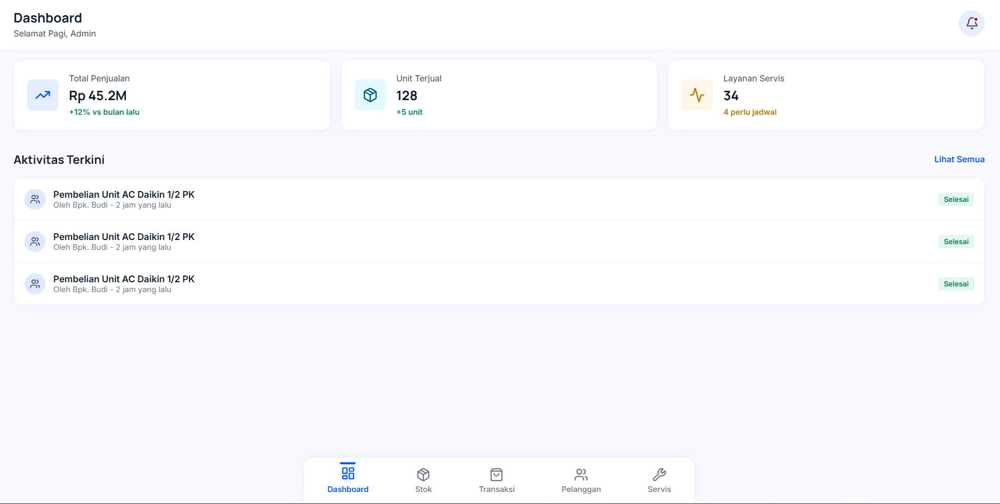
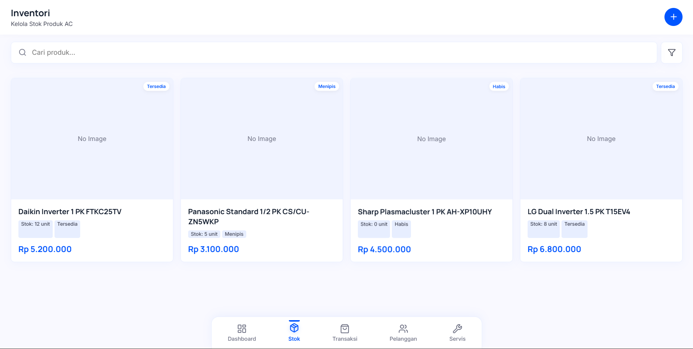
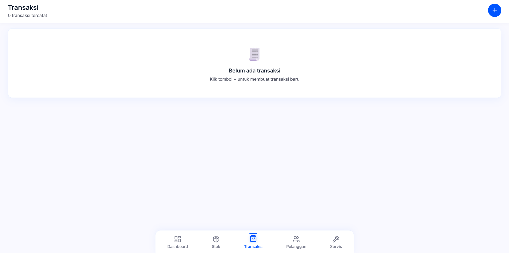
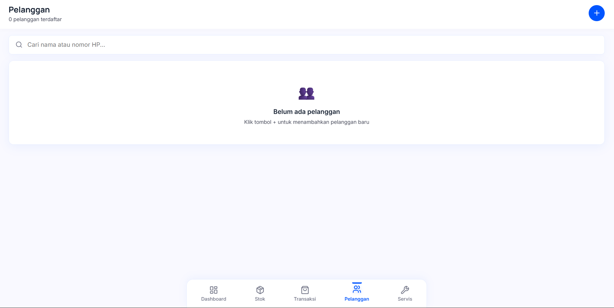
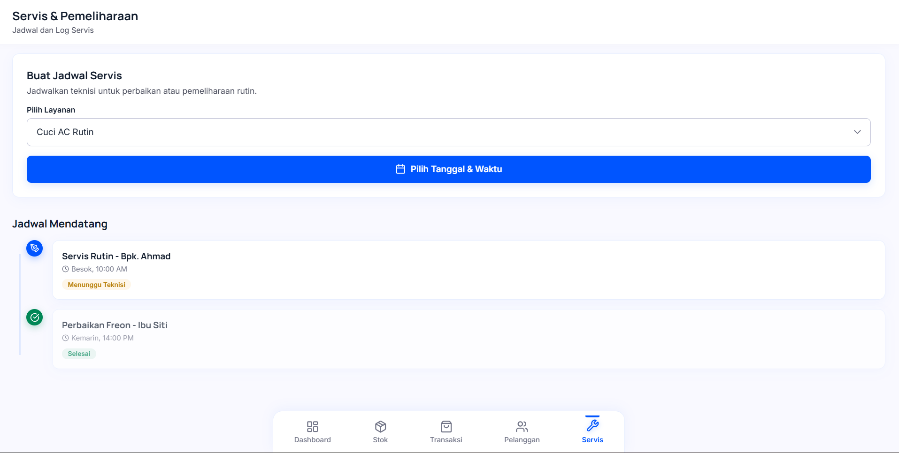

# ❄️ Arctic Clarity - AC Management System

Arctic Clarity adalah sistem manajemen retail dan layanan servis AC yang dirancang untuk profesional. Aplikasi ini membantu teknisi dan pemilik toko dalam melacak inventaris, mengelola data pelanggan, merekam transaksi, dan mengatur jadwal pemeliharaan rutin secara efisien.

---

## 📱 UI Preview

Berikut adalah tampilan antarmuka dari sistem Arctic Clarity:

| Dashboard Utama | Manajemen Inventori |
| :---: | :---: |
|  |  |
| *Ringkasan penjualan, unit terjual, dan aktivitas terkini.* | *Kelola stok produk AC dengan status ketersediaan.* |

| Manajemen Pelanggan | Riwayat Transaksi |
| :---: | :---: |
|  |  |
| *Database pelanggan terintegrasi.* | *Catat dan pantau semua transaksi penjualan.* |

| Penjadwalan Servis |
| :---: |
|  |
| *Atur jadwal teknisi dan log pemeliharaan rutin.* |

---

## ✨ Fitur Utama

- **📊 Dashboard Pintar**: Visualisasi data penjualan dan unit terjual secara real-time.
- **📦 Inventori Terpusat**: Monitoring stok unit AC dari berbagai merk dengan indikator status.
- **👥 CRM (Customer Relationship Management)**: Simpan data pelanggan untuk layanan purna jual yang lebih baik.
- **📅 Service Scheduler**: Buat dan pantau jadwal servis rutin teknisi.
- **📝 Manajemen Transaksi**: Pembuatan invoice dan riwayat transaksi yang rapi.
- **🔐 Keamanan Data**: Integrasi dengan Supabase untuk otentikasi dan database yang aman.

## 🚀 Teknologi

Aplikasi ini dibangun menggunakan teknologi modern:

- **Frontend**: [React.js](https://reactjs.org/) + [Vite](https://vitejs.dev/)
- **Styling**: Vanilla CSS (Premium & Responsive Design)
- **Database & Auth**: [Supabase](https://supabase.com/)
- **Routing**: React Router v6

## 🛠️ Cara Menjalankan

1. **Clone repositori**
   ```bash
   git clone https://github.com/Flyys-S/aplikasi-AC.git
   ```

2. **Instal dependensi**
   ```bash
   npm install
   ```

3. **Konfigurasi Environment**
   Buat file `.env.local` dan masukkan kredensial Supabase Anda:
   ```env
   VITE_SUPABASE_URL=your_url
   VITE_SUPABASE_ANON_KEY=your_key
   ```

4. **Jalankan aplikasi**
   ```bash
   npm run dev
   ```

---

> [!NOTE]
> Pastikan untuk menaruh file gambar screenshot di folder `./screenshots/` agar muncul di halaman ini.
