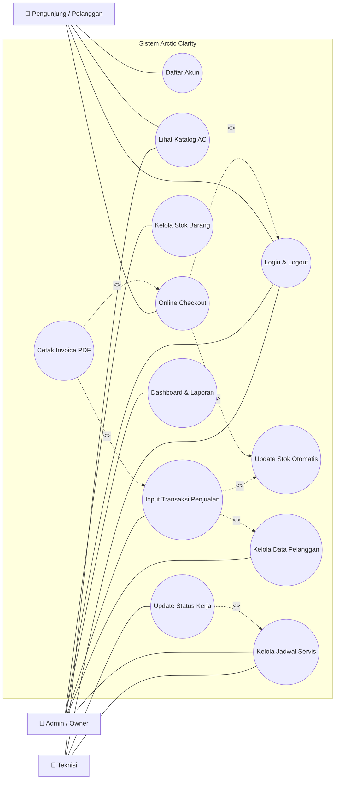
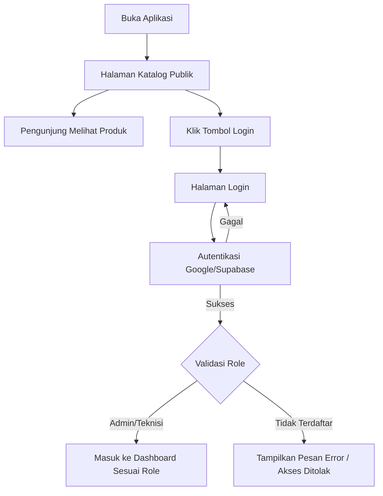
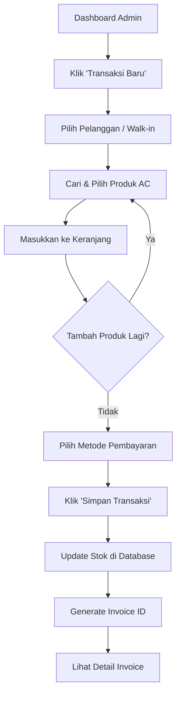
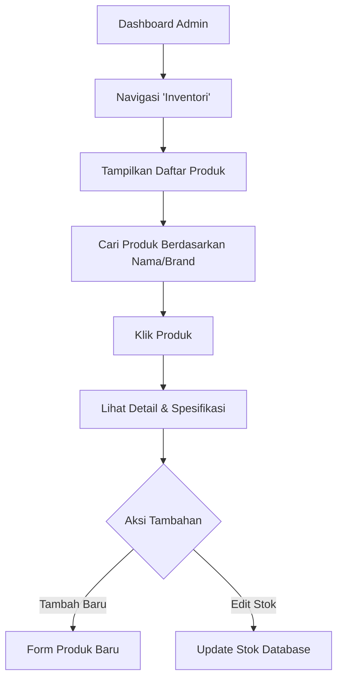
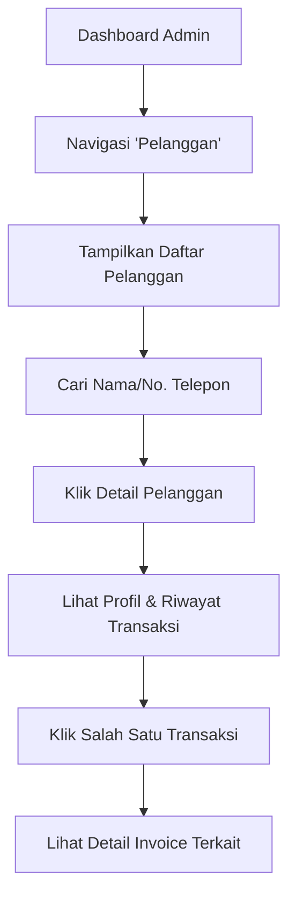
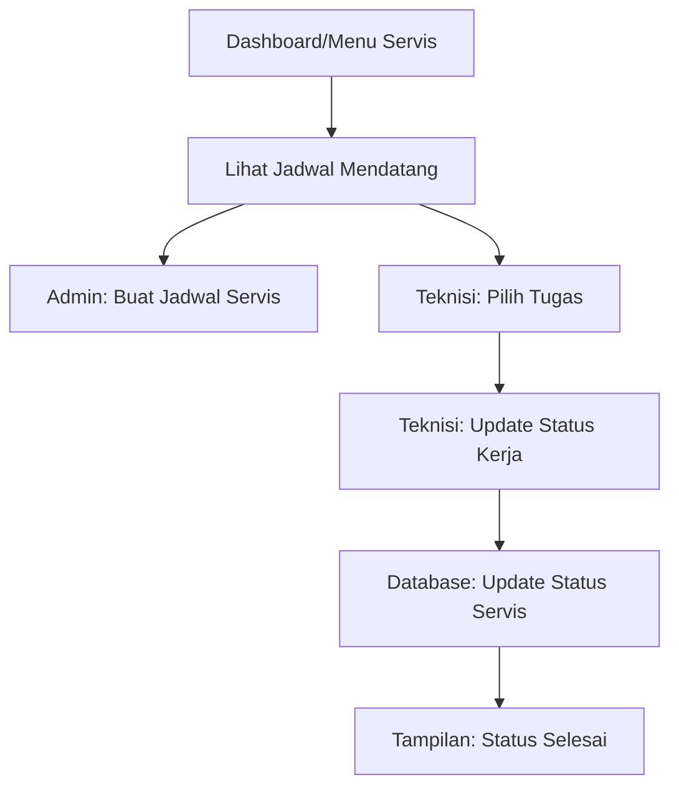
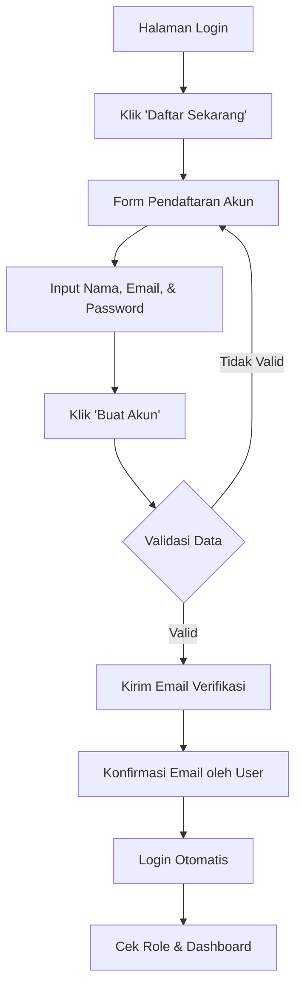

# Diagram Alur Aplikasi Arctic Clarity (Versi Katalog Terbuka)

File ini berisi dokumentasi alur kerja aplikasi dalam format **Mermaid.js**. Aplikasi menggunakan sistem *Open Catalog* di mana halaman depan dapat diakses secara publik.

## 1. Diagram Use Case (Detail Sistem Arctic Clarity)
Diagram ini menjelaskan hubungan antar fitur dengan relasi `<<include>>` (wajib ada) dan `<<extend>>` (opsional/tambahan) untuk alur kerja yang lebih akurat.



## 2. Alur Validasi Hak Akses (RBAC Logic)
Menjelaskan bagaimana sistem menentukan halaman yang boleh diakses user.

```mermaid
graph TD
    A[User Berhasil Login] --> B[Ambil Data Profile dari Supabase]
    B --> C{Cek Role User}
    C -- Admin -- > D[Akses Penuh: Dashboard, Finansial, Inventori, Servis]
    C -- Teknisi -- > E[Akses Terbatas: Jadwal Servis & Katalog]
    C -- Guest/Lainnya -- > F[Akses Hanya Katalog Produk]
    D --> G[Tampilkan Menu Lengkap]
    E --> H[Sembunyikan Menu Finansial]
    F --> I[Redirect ke Katalog]
```

## 3. Alur Masuk & Autentikasi Pengguna
Menjelaskan bagaimana pengguna mengakses katalog publik dan masuk ke sistem manajemen.



## 4. Alur Transaksi Penjualan (Internal Admin)
Hanya bisa dilakukan oleh Admin setelah login.



## 5. Alur Manajemen Inventori & Stok
Proses pengelolaan data produk oleh Admin.



## 6. Alur Manajemen Pelanggan
Pengelolaan data pelanggan dan riwayat transaksi.



## 7. Alur Penjadwalan Servis
Manajemen jadwal teknisi dan status pengerjaan.



## 8. Alur Pendaftaran Akun Baru (Email & Password)
**Status: Belum Diimplementasikan (Rencana Mendatang)**



---
*Catatan: Gunakan editor Markdown yang mendukung Mermaid (seperti VS Code dengan extension, GitHub, atau Notion) untuk melihat diagram secara visual.*

## 9. Alur Online Checkout (Pengunjung/Pelanggan)
Proses pembelian mandiri oleh pelanggan melalui katalog publik.

```mermaid
graph TD
    A[Buka Katalog Publik] --> B[Pilih Produk AC]
    B --> C[Klik Tombol 'Checkout']
    C --> D{Sudah Login?}
    D -- Belum -- > E[Halaman Login]
    E --> F[Login Berhasil]
    F --> G[Halaman Konfirmasi Pesanan]
    D -- Sudah -- > G
    G --> H[Input Alamat/Detail Pengiriman]
    H --> I[Pilih Metode Pembayaran]
    I --> J[Konfirmasi Pembayaran]
    J --> K[Sistem: Update Stok Database]
    K --> L[Sistem: Generate Invoice]
    L --> M[Tampilkan Invoice ke Pelanggan]
```
