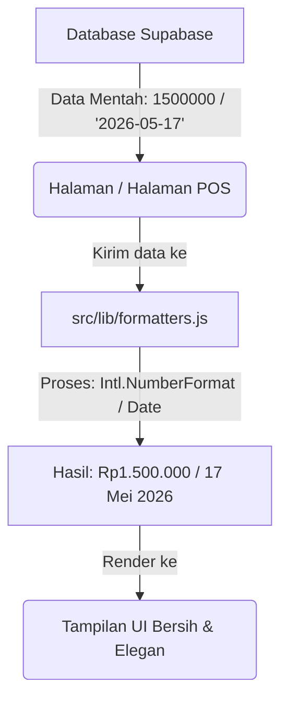
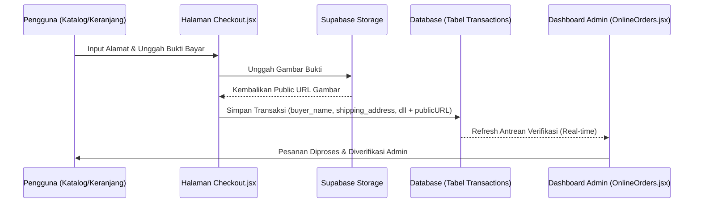
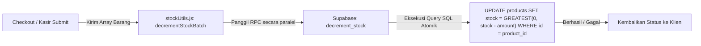
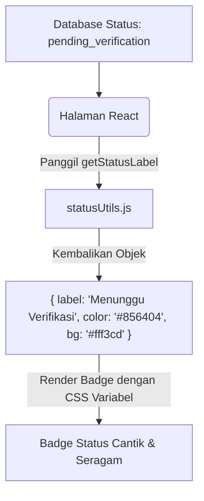

# Laporan Pembaruan Arsitektur & Refaktorisasi (Arctic Clarity)

Dokumen ini mencatat secara mendetail seluruh pembaruan arsitektur aplikasi **Arctic Clarity** yang mencakup Plan 1 hingga Plan 9. Setiap rencana (Plan) dilengkapi dengan penjelasan teknis, alasan perubahan, dampak file, serta alur kerja (*data flow*).

---

## 📋 Daftar Isi
1. [Plan 1 — Sentralisasi Utility Formatters](#plan-1--sentralisasi-utility-formatters)
2. [Plan 2 — Arsitektur Database & Form Data Pembeli Online](#plan-2--arsitektur-database--form-data-pembeli-online)
3. [Plan 3 — Pengurangan Stok secara Atomik (Supabase RPC)](#plan-3--pengurangan-stok-secara-atomik-supabase-rpc)
4. [Plan 4 — Sentralisasi Label & Warna Status UI](#plan-4--sentralisasi-label--warna-status-ui)
5. [Plan 5 — Reusable UI Components (Loader & Empty State)](#plan-5--reusable-ui-components-loader--empty-state)
6. [Plan 6 — Fallback UUID Pintar untuk Unggah File](#plan-6--fallback-uuid-pintar-untuk-unggah-file)
7. [Plan 7 — Migrasi Notifikasi Pop-Up (react-hot-toast)](#plan-7--migrasi-notifikasi-pop-up-react-hot-toast)
8. [Plan 8 — Clean-Up Debug Log (console.log)](#plan-8--clean-up-debug-log-consolelog)
9. [Plan 9 — Penghapusan Dead Code (useServiceOrders)](#plan-9--penghapusan-dead-code-useserviceorders)

---

## 1. Plan 1 — Sentralisasi Utility Formatters

### 🔍 Penjelasan
Sebelumnya, kode pemformatan mata uang Rupiah (`Rp`), angka ribuan, dan tanggal dilakukan secara manual menggunakan metode inline di berbagai file halaman. Hal ini membuat kode berulang, rentan terhadap bug `null/undefined`, dan sulit dikelola jika ada perubahan format global.

Dibuatlah modul terpusat di `src/lib/formatters.js` yang membungkus logika pemformatan menggunakan `Intl.NumberFormat` dan metode penanganan tanggal defensif (`new Date(dateString)` aman dari crash).

### 🛠️ Dampak File
*   **[NEW]** `src/lib/formatters.js` (Membuat helper `formatRupiah`, `formatRupiahCompact`, `formatAngka`, `formatTanggal`, `formatTanggalJam`).
*   **[MODIFIED]** `Inventory.jsx`, `Catalog.jsx`, `Checkout.jsx`, `ProductDetails.jsx`, `Transactions.jsx`, `InvoiceDetail.jsx`, `NewTransaction.jsx`, `SalesDashboard.jsx`, `OnlineOrders.jsx`.

### 🔄 Alur Kerja (*Flow*)


---

## 2. Plan 2 — Arsitektur Database & Form Data Pembeli Online

### 🔍 Penjelasan
Untuk mendukung sistem pesanan online, tabel `transactions` memerlukan data identitas pengiriman pembeli serta bukti transfer pembayaran digital. Sebelumnya, data transaksi hanya mencatat relasi kasir dan pembeli walk-in.

Dilakukan perubahan skema basis data di Supabase untuk menampung data pembeli dan URL bukti transaksi, serta memperbarui formulir pemrosesan di sisi klien.

### 🛠️ Dampak File
*   **[DATABASE SQL]** Migrasi tabel `transactions` (Menambah kolom: `buyer_name`, `buyer_phone`, `shipping_address`, `payment_proof_url`).
*   **[MODIFIED]** `Checkout.jsx` (Membuat input formulir detail pembeli & pengunggahan gambar ke Supabase Storage `payment_proofs`).
*   **[MODIFIED]** `OnlineOrders.jsx` (Menampilkan detail kartu pesanan lengkap dengan nama pembeli, nomor HP, alamat kirim, dan tombol preview bukti transfer).

### 🔄 Alur Kerja (*Flow*)


---

## 3. Plan 3 — Pengurangan Stok secara Atomik (Supabase RPC)

### 🔍 Penjelasan
Salah satu bug kritis dalam sistem POS/E-Commerce adalah *Race Condition* (stok minus atau tidak akurat ketika ada dua order masuk di detik yang sama). Kode lama mengambil stok lama ke klien, menguranginya di JavaScript, dan menulis kembali ke DB.

Solusinya adalah memindahkan kalkulasi pengurangan stok langsung ke tingkat basis data menggunakan fungsi PostgreSQL RPC (`decrement_stock`) yang bersifat atomik (terkunci dengan transaksi aman).

### 🛠️ Dampak File
*   **[DATABASE RPC]** SQL Function `decrement_stock(product_id, amount)`.
*   **[NEW]** `src/lib/stockUtils.js` (Membuat pemrosesan batch `decrementStockBatch(cartItems)`).
*   **[MODIFIED]** `NewTransaction.jsx` & `OnlineOrders.jsx` (Menghapus pengurangan manual klien, beralih ke `decrementStockBatch`).

### 🔄 Alur Kerja (*Flow*)


---

## 4. Plan 4 — Sentralisasi Label & Warna Status UI

### 🔍 Penjelasan
Status transaksi, pemesanan online, dan tugas perawatan memiliki beragam status seperti `pending`, `completed`, `cancelled`, dll. Sebelumnya, setiap halaman memetakan status ini ke teks bahasa Indonesia dan warna CSS secara berulang menggunakan blok `switch-case` di dalam kode JSX.

Dibuat utilitas `statusUtils.js` untuk memetakan setiap status ke dalam satu konfigurasi terpusat yang berisi label bahasa Indonesia, warna teks HSL/Hex, dan warna latar belakang (*background* badge).

### 🛠️ Dampak File
*   **[NEW]** `src/lib/statusUtils.js` (Fungsi `getStatusLabel(status)`).
*   **[MODIFIED]** `Transactions.jsx`, `OnlineOrders.jsx`, `SalesDashboard.jsx`, `CustomerDetail.jsx`.

### 🔄 Alur Kerja (*Flow*)


---

## 5. Plan 5 — Reusable UI Components (Loader & Empty State)

### 🔍 Penjelasan
Untuk menjaga konsistensi visual aplikasi (Aesthetic Excellence), kita menghilangkan spinner bawaan browser, animasi CSS manual yang berbeda-beda, dan div teks "Data Kosong" yang tampak polos.

Tiga komponen premium dibuat di folder `components/` untuk menangani transisi layar penuh, loader kontainer, dan representasi visual saat data tidak ditemukan dengan memanfaatkan ikon dari `lucide-react`.

### 🛠️ Dampak File
*   **[NEW]** `src/components/PageLoader.jsx` (Layar penuh memuat sistem).
*   **[NEW]** `src/components/InlineLoader.jsx` (Memuat data di dalam kartu/tabel).
*   **[NEW]** `src/components/EmptyState.jsx` (Menampilkan ilustrasi ikon halus, judul, dan subjudul tombol bantu).
*   **[MODIFIED]** 10 Halaman Utama (Mengimpor dan menggantikan UI manual dengan komponen terpusat baru).

---

## 6. Plan 6 — Fallback UUID Pintar untuk Unggah File

### 🔍 Penjelasan
Fungsi Javascript `crypto.randomUUID()` sangat aman digunakan untuk menamai file yang diunggah agar tidak saling bertabrakan (*filename collision*). Namun, fungsi ini hanya aktif pada browser yang berada dalam *Secure Context* (HTTPS atau localhost). Jika admin mengakses aplikasi dari HP menggunakan IP lokal komputer (`http://192.168.1.x:5173`), fungsi ini bernilai `undefined` dan menyebabkan aplikasi *crash* total saat unggah gambar.

Pembaruan ini menambahkan fungsi *fallback* cerdas yang mendeteksi ketersediaan API browser secara proaktif.

### 🛠️ Dampak File
*   **[MODIFIED]** `ProductDetails.jsx` & `Checkout.jsx`.

### 💻 Cuplikan Kode Solusi
```javascript
const generateUniqueId = () => {
  if (typeof crypto !== 'undefined' && crypto.randomUUID) {
    return crypto.randomUUID();
  }
  // Fallback tangguh jika diakses via HTTP non-secure
  return `${Date.now()}-${Math.random().toString(36).substring(2, 9)}`;
};
```

---

## 7. Plan 7 — Migrasi Notifikasi Pop-Up (react-hot-toast)

### 🔍 Penjelasan
Menggunakan `alert()` bawaan browser terlihat kuno, menghentikan seluruh proses eksekusi thread Javascript, dan mengganggu kenyamanan pengguna.

Kami mengintegrasikan pustaka `react-hot-toast` yang memiliki animasi pop-up super halus, non-blocking, serta mudah diubahsuai warnanya agar sesuai dengan identitas desain premium aplikasi.

### 🛠️ Dampak File
*   **[DEPENDENCY]** Instalasi `react-hot-toast` via npm.
*   **[MODIFIED]** `App.jsx` (Memasang komponen global `<Toaster />` di root).
*   **[MODIFIED]** Semua modul pemroses formulir: `UserManagement.jsx`, `ServiceMaintenance.jsx`, `ProductDetails.jsx`, `OnlineOrders.jsx`, `NewTransaction.jsx`, `Checkout.jsx`, `AuthContext.jsx`.

---

## 8. Plan 8 — Clean-Up Debug Log (console.log)

### 🔍 Penjelasan
Log konsol pengujian (*debug logs*) yang tertinggal dari masa pengembangan dapat membocorkan informasi struktur internal database, data sensitif pengguna, serta mengotori konsol peramban pada tahap produksi.

Semua pemanggilan `console.log` yang tidak kritis telah dibersihkan secara aman, sementara logging kritis (seperti `console.error` untuk melacak error crash) tetap dipertahankan demi kemudahan debugging mendatang.

### 🛠️ Dampak File
*   **[MODIFIED]** `Login.jsx`, `AuthContext.jsx`, `BottomNavigation.jsx` (Menghapus log pemantauan render dan cetak objek).

---

## 9. Plan 9 — Penghapusan Dead Code (useServiceOrders)

### 🔍 Penjelasan
Seiring evolusi arsitektur aplikasi ke arah modular, beberapa fungsi atau hook kustom tidak lagi digunakan oleh komponen manapun. Contohnya adalah hook `useServiceOrders` di dalam modul Supabase. Membiarkan kode mati (*dead code*) menumpuk akan membingungkan developer baru dan memperbesar ukuran build JavaScript final.

### 🛠️ Dampak File
*   **[MODIFIED]** `src/hooks/useSupabase.js` (Menghapus ekspor fungsi `useServiceOrders`).

---

## 📈 Kesimpulan Hasil Refaktorisasi
Dengan selesainya Plan 1 s.d. Plan 9, aplikasi **Arctic Clarity** kini memiliki pondasi kode yang kokoh, visual yang seragam dan premium (Wow Factor), performa transaksi yang aman dari bug stok, serta siap untuk dikembangkan lebih jauh tanpa adanya kendala teknis yang menumpuk (*technical debt*).
